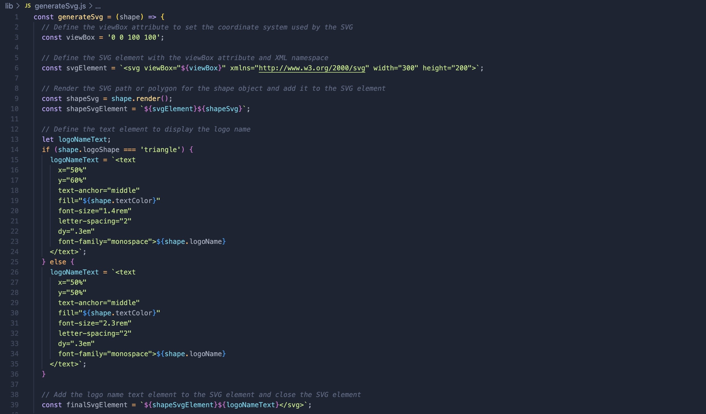
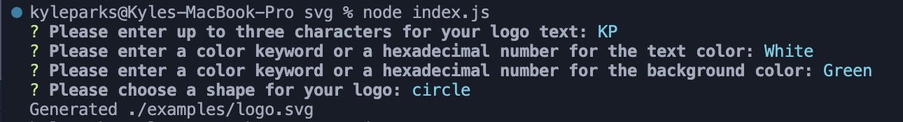

# Your own SVG Logo

# Description

This application will create a custom SVG logo for you! It prompts the user for a three leter icon, text color, background color, and shape of the logo. Once answered, the application will generate an SVG logo and place it in the examples folder. This propject utilizes Node.js, Inquirer, and Jest.

# Table of Contents
* [Installation](#installation)
* [Usage](#usage)
* [Credits](#credits)

# Installation

To install this project, clone the repository from GitHub and open it in your own IDE.

# Video

# Usage

In your IDE, open the command line and type in node index.js, and answer the prompts in the command line. After the svg file is created, in your terminal type in jest and it should run a test on the code. 

Screenshots of the code

# Credits

This application was built from scratch by Kyle Parks